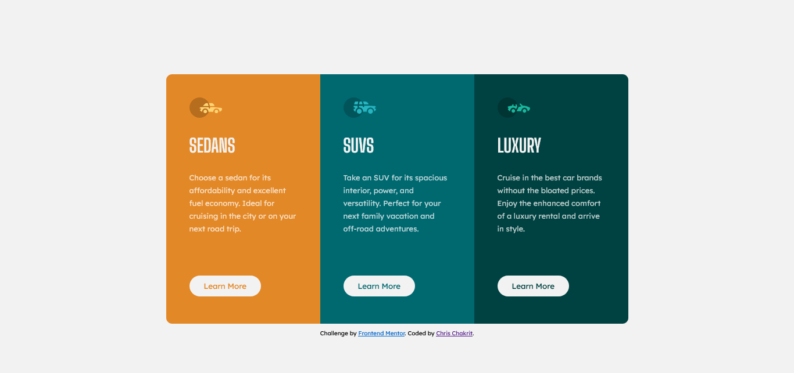

# 3-column-preview-card-component

This is a solution to the [QR code component challenge on Frontend Mentor](https://www.frontendmentor.io/challenges/qr-code-component-iux_sIO_H). Frontend Mentor challenges help you improve your coding skills by building realistic projects.

## Table of contents

- [Overview](#overview)
  - [Screenshot](#screenshot)
  - [Links](#links)
  - [Built with](#built-with)
  - [What I learned](#what-i-learned)
  - [Continued development](#continued-development)

## Overview

### Screenshot

### Links

- Solution URL: https://chrischakrit.github.io/3-column-preview-card-component/

### Built with

- Semantic HTML5 markup
- CSS custom properties
- Flexbox

### What I learned

- HTML5, CSS3, Flexbox
- Media Query
- cursor hover and pointer

### Continued development

- CSS grid
